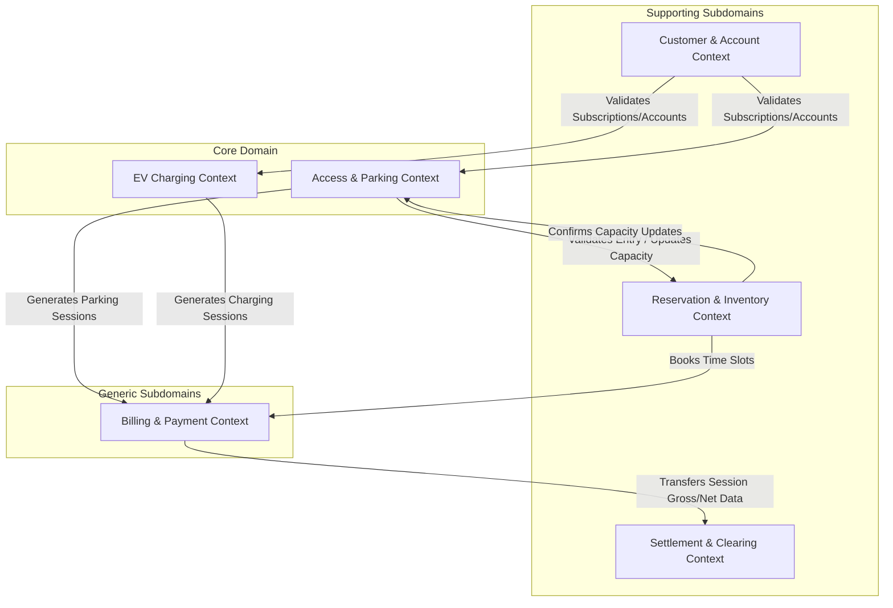

# Domain-Driven Design (DDD) for EasyParkPlus

Based on the requirements and the technical interview with Michael, the Technical Manager, here is the Domain-Driven Design for the EasyParkPlus system, including the new Electric Vehicle (EV) Charging Station Management feature.

## 1. Core Domain and Subdomains

**Core Domain:** The core competitive advantage of EasyParkPlus revolves around providing seamless, integrated **Parking Management** combined with **EV Charging Management**. 

**Subdomains:**
* **Core Subdomains:** 
    * Access Control & Parking Sessions (Offline-capable)
    * EV Charging Station Management (OCPP integration)
* **Supporting Subdomains:** 
    * Reservations and Space Inventory
    * Customer Accounts & Memberships
    * Settlement & Clearing (3rd-party vendor revenue sharing)
* **Generic Subdomains:** 
    * Billing & Payments (Outsourced processing but internal rules)
    * Reporting, Finance, and Audits
    * Maintenance & Asset Management

---

## 2. Bounded Contexts

Based on the subdomains, we can define the following **Bounded Contexts** to compartmentalize the system:

> [!IMPORTANT]
> **Offline Autonomy:** The **Access & Parking Context** and **EV Charging Context** must be deployed locally at the facility level (Edge Nodes) as well as centrally (Cloud), ensuring that local operations (gates opening, chargers starting) continue when the internet connection drops.

---

## 3. Bounded Context Definitions & Ubiquitous Language

### A. Access & Parking Context
* **Responsibilities:** Handling vehicle entry/exit, tracking active parking sessions, local capacity tracking, and physical gate control. Must operate independently during internet outages.
* **Ubiquitous Language:** Parking Session, Ticket, Entry Gate, Exit Gate, License Plate Recognition (LPR), Capacity Buffer, Offline Mode.

### B. EV Charging Context
* **Responsibilities:** Managing EV charger hardware, tracking charging sessions, communicating with OCPP gateways, and monitoring real-time charger states.
* **Ubiquitous Language:** Charging Session, Charger Status, EV Bay, OCPP, Connector, Energy Consumed (kWh), Idle Grace Period.

### C. Customer & Account Context
* **Responsibilities:** Managing global user accounts, monthly subscriptions, saved payment methods, and vehicle profiles.
* **Ubiquitous Language:** Customer Account, Monthly Parking Contract, Saved Payment Method, Vehicle Profile, Subscriber.

### D. Billing & Payment Context
* **Responsibilities:** Applying pricing rules, calculating combined fees (parking duration + EV usage + idle fees), processing credit card transactions, and generating unified invoices.
* **Ubiquitous Language:** Tariff Rule, Unified Invoice, Idle Fee, Payment Transaction, Base Rate, Dynamic Pricing.

### E. Reservation & Inventory Context
* **Responsibilities:** Central management of advanced bookings and coordinating capacity buffers with facilities to prevent overbooking while allowing drive-up traffic.
* **Ubiquitous Language:** Reservation, Guaranteed Spot, Capacity Buffer, Degraded Mode, Yield Management.

### F. Settlement & Clearing Context
* **Responsibilities:** Reconciling financial transactions and splitting revenue between EasyParkPlus, 3rd party EV charger operators, and landlords.
* **Ubiquitous Language:** Revenue Share, Vendor Invoice, Net Amount, Gross Amount, Reconciliation, Ledger Entry.

---

## 4. Basic Domain Models (Entities, Value Objects, Aggregates)

Here is a preliminary structural model for the core contexts and the supporting contexts that interact directly with parking and EV charging.

### Access & Parking Domain Model
* **Aggregate Root: `ParkingSession`**
    * **Properties:** SessionID, FacilityID, EntryTime, ExitTime, Status (Active, PaymentPending, Completed, Cancelled), SessionType (Transient, Reservation, MonthlySubscriber), OfflineCaptured flag
    * **Entities:** `Ticket`, `VehicleSnapshot`, `AccessDecision`
    * **Value Objects:** `LicensePlate`, `Duration`, `EntryCredential`, `ParkingRateSnapshot`
    * **Invariants:** A session must have one entry event before exit; an exit gate cannot open until payment/subscription validation succeeds; duplicate active sessions for the same license plate and facility are rejected.
* **Aggregate Root: `FacilityInventory`**
    * **Properties:** FacilityID, TotalCapacity, AvailableCapacity, ReservedCapacityBuffer, OperatingMode (Online, Offline, Degraded)
    * **Entities:** `ParkingSpot`, `Gate`, `FacilityRuleOverride`
    * **Value Objects:** `CapacityCount`, `SpotType` (Regular, EV, Accessible, Reserved), `GateStatus`
    * **Invariants:** Reservations have priority over subscribers, and subscribers have priority over drive-up traffic during degraded/offline operation; drive-up entries must not consume the reserved capacity buffer.
* **Entity: `Facility`**
    * **Properties:** FacilityID, City, Address, LocalTimezone, AccessMechanism (BoomGate, LPR, Hybrid)

### EV Charging Domain Model
* **Aggregate Root: `ChargingSession`**
    * **Properties:** ChargingSessionID, FacilityID, ParkingSessionID, StartTime, EndTime, Status (Preparing, Charging, Suspended, Finishing, Completed, Faulted), VendorSessionID
    * **Entities:** `ChargingMeterReading`, `IdleFeeAssessment`
    * **Value Objects:** `EnergyConsumed` (kWh), `IdleDuration` (Minutes), `ConnectorID`, `ChargingTariffSnapshot`
    * **Invariants:** A charging session must be linked to a designated EV bay; idle fees start only after the configured grace period; interrupted or faulted sessions keep enough meter data for adjustment and settlement.
* **Aggregate Root: `ChargerAsset`**
    * **Properties:** ChargerID, FacilityID, Vendor, Protocol (OCPP or VendorAPI), MaxOutput, Status (Available, Occupied, Preparing, Charging, Suspended, Finishing, Faulted, Offline)
    * **Entities:** `Connector`, `MaintenanceState`
    * **Value Objects:** `PowerRating`, `OcppEndpoint`, `HeartbeatTimestamp`
    * **Invariants:** A charger can expose one or more connectors, but each connector can serve only one active charging session at a time.
* **Entity: `EVBay`**
    * **Properties:** BayID, FacilityID, LinkedChargerID, LinkedConnectorID, Location, OccupancyStatus, ReservationEligibility
    * **Rule:** Dual-port chargers may map to two adjacent EV bays; charger state and physical bay occupancy are tracked separately.

### Reservation & Inventory Domain Model
* **Aggregate Root: `Reservation`**
    * **Properties:** ReservationID, CustomerID, FacilityID, ReservedWindow, SpotTypeRequested, Status (Requested, Confirmed, Honored, NoShow, Cancelled)
    * **Value Objects:** `ReservationPriority`, `CapacityHold`, `ReservationWindow`
    * **Invariants:** Central reservations can continue while a facility is offline, but capacity buffers limit overbooking; conflicts after reconnection are resolved by priority: reservations, then subscriptions, then drive-up traffic.

### Billing, Pricing & Settlement Domain Model
* **Aggregate Root: `UnifiedInvoice`**
    * **Properties:** InvoiceID, CustomerID, ParkingSessionID, ChargingSessionID, TotalAmount, Status (Pending, Paid, Failed, Adjusted)
    * **Entities:** `PaymentTransaction`, `SettlementAllocation`
    * **Value Objects:** `ChargeLineItem` (Parking Fee, Charging Fee, Idle Fee), `TariffRule`, `Money`, `TaxBreakdown`
    * **Invariants:** Parking and charging may be presented as one receipt while preserving separate line items for tax, refunds, and settlement.
* **Aggregate Root: `TariffPolicy`**
    * **Properties:** PolicyID, FacilityID, EffectivePeriod, Source (Corporate, FacilityOverride, Regulatory)
    * **Value Objects:** `ParkingRate`, `ChargingRate`, `IdleFeeRule`, `OverrideLimit`
    * **Rule:** Corporate operations own the default source of truth, while facility managers can apply controlled local overrides within approved limits.
* **Aggregate Root: `SettlementBatch`**
    * **Properties:** BatchID, SettlementPeriod, Status, VendorID, FacilityID
    * **Entities:** `LedgerEntry`, `VendorInvoiceMatch`, `Adjustment`
    * **Value Objects:** `RevenueShareRule`, `GrossAmount`, `NetAmount`
    * **Rule:** Third-party charger revenue, landlord shares, idle fees, refunds, and failed-session adjustments must be reconcilable from session-level records.

> [!NOTE]
> The `UnifiedInvoice` acts as the financial sink where the `ParkingSession` and `ChargingSession` are combined to present a single payment request to the driver, satisfying the business requirement for a unified customer experience while preserving separate tracking for settlement.
