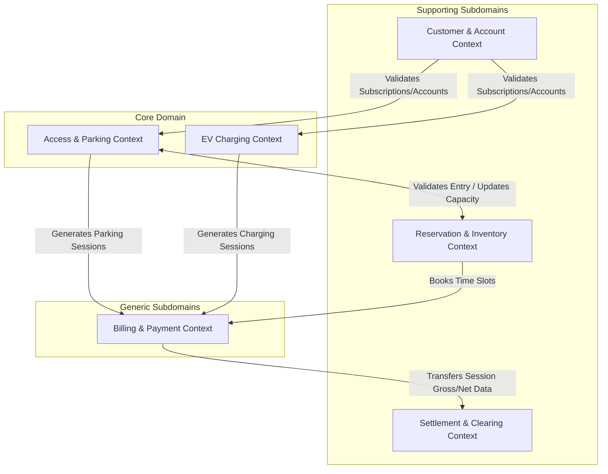

# Domain-Driven Design (DDD) for EasyParkPlus

Based on the requirements and the technical interview with Michael, the Technical Manager, here is the Domain-Driven Design for the EasyParkPlus system, including the new Electric Vehicle (EV) Charging Station Management feature.

## 1. Core Domain and Subdomains

**Core Domain:** The core competitive advantage of EasyParkPlus revolves around providing seamless, integrated **Parking Management** combined with **EV Charging Management**. 

**Subdomains:**
* **Core Subdomains:** 
    * Access Control & Parking Sessions (Offline-capable)
    * EV Charging Station Management (OCPP integration)
* **Supporting Subdomains:** 
    * Reservations and Space Inventory
    * Customer Accounts & Memberships
    * Settlement & Clearing (3rd-party vendor revenue sharing)
* **Generic Subdomains:** 
    * Billing & Payments (Outsourced processing but internal rules)
    * Reporting, Finance, and Audits
    * Maintenance & Asset Management

---

## 2. Bounded Contexts

Based on the subdomains, we can define the following **Bounded Contexts** to compartmentalize the system:

> [!IMPORTANT]
> **Offline Autonomy:** The **Access & Parking Context** and **EV Charging Context** must be deployed locally at the facility level (Edge Nodes) as well as centrally (Cloud), ensuring that local operations (gates opening, chargers starting) continue when the internet connection drops.

---

## 3. Bounded Context Definitions & Ubiquitous Language

### A. Access & Parking Context
* **Responsibilities:** Handling vehicle entry/exit, tracking active parking sessions, local capacity tracking, and physical gate control. Must operate independently during internet outages.
* **Ubiquitous Language:** Parking Session, Ticket, Entry Gate, Exit Gate, License Plate Recognition (LPR), Capacity Buffer, Offline Mode.

### B. EV Charging Context
* **Responsibilities:** Managing EV charger hardware, tracking charging sessions, communicating with OCPP gateways, and monitoring real-time charger states.
* **Ubiquitous Language:** Charging Session, Charger Status, EV Bay, OCPP, Connector, Energy Consumed (kWh), Idle Grace Period.

### C. Customer & Account Context
* **Responsibilities:** Managing global user accounts, monthly subscriptions, saved payment methods, and vehicle profiles.
* **Ubiquitous Language:** Customer Account, Monthly Parking Contract, Saved Payment Method, Vehicle Profile, Subscriber.

### D. Billing & Payment Context
* **Responsibilities:** Applying pricing rules, calculating combined fees (parking duration + EV usage + idle fees), processing credit card transactions, and generating unified invoices.
* **Ubiquitous Language:** Tariff Rule, Unified Invoice, Idle Fee, Payment Transaction, Base Rate, Dynamic Pricing.

### E. Reservation & Inventory Context
* **Responsibilities:** Central management of advanced bookings and coordinating capacity buffers with facilities to prevent overbooking while allowing drive-up traffic.
* **Ubiquitous Language:** Reservation, Guaranteed Spot, Capacity Buffer, Degraded Mode, Yield Management.

### F. Settlement & Clearing Context
* **Responsibilities:** Reconciling financial transactions and splitting revenue between EasyParkPlus, 3rd party EV charger operators, and landlords.
* **Ubiquitous Language:** Revenue Share, Vendor Invoice, Net Amount, Gross Amount, Reconciliation, Ledger Entry.

---

## 4. Basic Domain Models (Entities, Value Objects, Aggregates)

Here is a preliminary structural model for the two core contexts.

### Access & Parking Domain Model
* **Aggregate Root: `ParkingSession`**
    * **Properties:** SessionID, EntryTime, ExitTime, Status (Active, Completed)
    * **Value Objects:** `Ticket` (or LicensePlate ID), `Duration`
* **Entity: `Facility`**
    * **Properties:** FacilityID, TotalCapacity, AvailableCapacity
* **Entity: `Gate`**
    * **Properties:** GateID, GateType (Entry/Exit), Status (Open/Closed/Fault)

### EV Charging Domain Model
* **Aggregate Root: `ChargingSession`**
    * **Properties:** ChargingSessionID, StartTime, EndTime, Status (Preparing, Charging, Suspended, Finishing)
    * **Value Objects:** `EnergyConsumed` (kWh), `IdleDuration` (Minutes)
* **Entity: `Charger`**
    * **Properties:** ChargerID, Vendor, MaxOutput, Protocol (e.g., OCPP)
* **Entity: `EVBay`**
    * **Properties:** BayID, Location, IsOccupied

### Billing & Payment Domain Model (Intersection)
* **Aggregate Root: `UnifiedInvoice`**
    * **Properties:** InvoiceID, CustomerID, TotalAmount, Status (Pending, Paid, Failed)
    * **Entities:** `PaymentTransaction`
    * **Value Objects:** `ChargeLineItem` (e.g., Parking Fee, Charging Fee, Idle Fee), `TariffRule`

> [!NOTE]
> The `UnifiedInvoice` acts as the financial sink where the `ParkingSession` and `ChargingSession` are combined to present a single payment request to the driver, satisfying the business requirement for a unified customer experience while preserving separate tracking for settlement.
