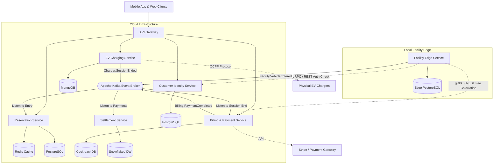

# EasyParkPlus Microservices Architecture

Based on the Domain-Driven Design (DDD) bounded contexts, the following is the proposed microservices-based software architecture for the EasyParkPlus system, scaled to support EV Charging Management across multiple facilities.

## 1. High-Level Architecture Diagram

---

## 2. Identified Services & Responsibilities

1. **Facility Edge Service (Edge Deployment)**
   - **Responsibility:** Runs locally on edge servers inside the parking garage. Controls the barrier gates, processes LPR (License Plate Recognition) reads, issues tickets, and records local vehicle entry/exit events. Ensures the garage continues operating seamlessly during internet outages.
   
2. **EV Charging Service**
   - **Responsibility:** Communicates with physical EV chargers via the OCPP protocol. Tracks active charging sessions, reads energy consumption (kWh) telemetry, and updates real-time availability of EV parking spots.

3. **Customer Identity Service**
   - **Responsibility:** The single source of truth for global customer profiles, authentication (login/registration), monthly parking subscriptions, and storing secure references to payment methods.

4. **Billing & Payment Service**
   - **Responsibility:** Executes complex pricing logic to calculate combined tariffs (parking duration + EV usage + idle fees). Integrates with external payment gateways (e.g., Stripe) to process transactions and generates the `UnifiedInvoice`.

5. **Reservation Service**
   - **Responsibility:** Centralized booking engine. Manages capacity buffers, allows users to reserve parking spots and EV chargers in advance, and coordinates live inventory updates.

6. **Settlement Service**
   - **Responsibility:** Handles offline, heavy batch reporting and financial reconciliation. It splits revenue from combined transactions between EasyParkPlus, 3rd party charger networks, and facility landlords based on complex contractual rules.

---

## 3. Database per Service Approach

To maintain loose coupling and high availability, the architecture follows the Database-per-Service pattern, selecting the best data store for the specific domain needs:

- **Facility Edge Service DB:** Local `PostgreSQL` instances for offline transactional ACID capabilities, synced asynchronously to the cloud.
- **EV Charging DB:** `MongoDB` (NoSQL) is used for its schema flexibility to handle high-frequency, varying IoT telemetry and charger status updates.
- **Customer Identity DB:** `PostgreSQL` for strict relational data integrity regarding user accounts and authentication.
- **Billing & Payment DB:** `CockroachDB` (or a highly available PostgreSQL cluster) to guarantee strict distributed ACID properties necessary for financial ledgers.
- **Reservation DB:** `Redis` for high-performance distributed locking and fast availability checks, paired with `PostgreSQL` for persisting confirmed bookings.
- **Settlement DB:** `Snowflake` or an equivalent Data Warehouse optimized for heavy OLAP analytical queries, batch processing, and historical reporting.

---

## 4. APIs and Endpoints

### External Facing (Exposed via API Gateway)
- **Reservation Service:**
  - `POST /api/v1/reservations` - Create a new booking
  - `GET /api/v1/availability?facilityId={id}` - Check live open spots
- **EV Charging Service:**
  - `GET /api/v1/chargers?facilityId={id}` - Retrieve live charger statuses
  - `POST /api/v1/charging/stop` - Remotely stop a charging session via the app
- **Customer Identity Service:**
  - `POST /api/v1/auth/login` - Authenticate users and return JWTs
  - `GET /api/v1/customers/me/vehicles` - List saved license plates
- **Billing & Payment Service:**
  - `GET /api/v1/invoices/history` - View past unified receipts

### Internal Service-to-Service (Synchronous)
Used when an immediate response is required to proceed with an action:
- `GET /internal/customers/{id}/status` - The Facility Edge Service checks via REST/gRPC if a driver has an active subscription before opening the monthly subscriber gate.
- `POST /internal/billing/calculate` - The Facility Service asks the Billing Service to compute the dynamic exit fee.

### Internal Service-to-Service (Asynchronous)
Used to decouple services via the Apache Kafka Event Broker:
- `Facility.VehicleEntered` - Published by the Edge Service when a car enters. The Reservation Service consumes this to decrement live inventory capacity.
- `Charger.SessionEnded` - Published by the EV Service when a charge completes. The Billing Service consumes this to trigger the unified invoice compilation.
- `Billing.PaymentCompleted` - Published by the Billing Service. The Settlement Service consumes this asynchronously to queue the transaction for revenue splitting.
