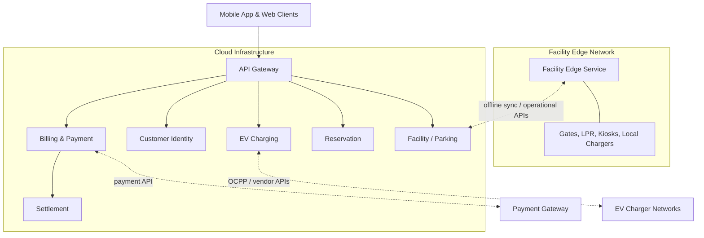
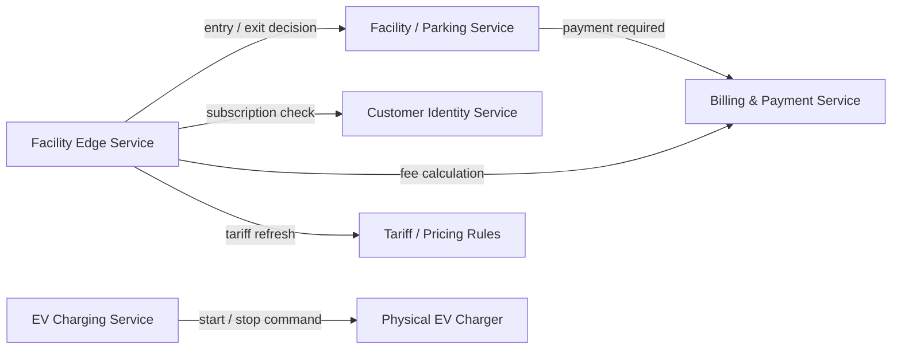
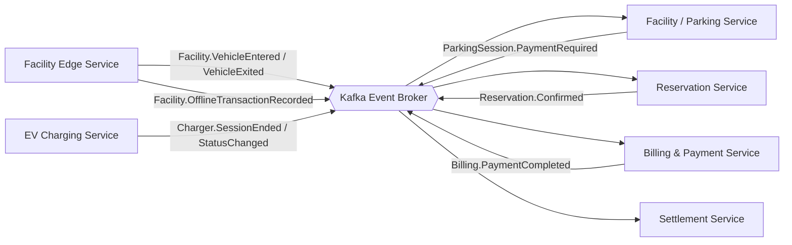
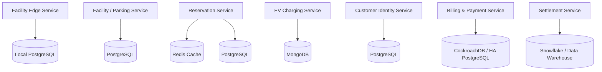

# EasyParkPlus Microservices Architecture

Based on the Domain-Driven Design (DDD) bounded contexts, the following is the proposed microservices-based software architecture for the EasyParkPlus system, scaled to support EV Charging Management across multiple facilities.

## 1. High-Level Architecture Diagram

This diagram shows the major deployment areas and system boundaries only. Detailed service calls, events, and databases are broken out into focused diagrams below.

### Operational Flow Diagram

This diagram focuses on synchronous calls that must return immediately for entry, exit, payment, or charger commands.

### Event Flow Diagram

This diagram shows asynchronous events used for decoupling, reconciliation, and reporting.

### Database Ownership Diagram

This diagram separates the database-per-service concern from the high-level architecture view.

---

## 2. Identified Services & Responsibilities

1. **Facility Edge Service (Edge Deployment)**
   - **Responsibility:** Runs locally on edge servers inside the parking garage. Controls the barrier gates, processes LPR (License Plate Recognition) reads, issues tickets, and records local vehicle entry/exit events. Ensures the garage continues operating seamlessly during internet outages.
   
2. **Facility / Parking Service**
   - **Responsibility:** Owns cloud-side facility configuration, parking sessions, capacity summaries, and cross-facility parking history. It receives synced edge events from each garage and coordinates parking-session state with reservations, billing, and reporting.

3. **EV Charging Service**
   - **Responsibility:** Communicates with physical EV chargers via the OCPP protocol. Tracks active charging sessions, reads energy consumption (kWh) telemetry, and updates real-time availability of EV parking spots.

4. **Customer Identity Service**
   - **Responsibility:** The single source of truth for global customer profiles, authentication (login/registration), monthly parking subscriptions, and storing secure references to payment methods.

5. **Billing & Payment Service**
   - **Responsibility:** Executes complex pricing logic to calculate combined tariffs (parking duration + EV usage + idle fees). Integrates with external payment gateways (e.g., Stripe) to process transactions and generates the `UnifiedInvoice`.

6. **Reservation Service**
   - **Responsibility:** Centralized booking engine. Manages capacity buffers, allows users to reserve parking spots and EV chargers in advance, and coordinates live inventory updates.

7. **Settlement Service**
   - **Responsibility:** Handles offline, heavy batch reporting and financial reconciliation. It splits revenue from combined transactions between EasyParkPlus, 3rd party charger networks, and facility landlords based on complex contractual rules.

---

## 3. Architecture Justification and DevOps Considerations

The proposed architecture is more complex than the current single-lot prototype, but it is intended as a **target-state architecture**, not an immediate full implementation. This is consistent with the project requirement to describe a preliminary microservices architecture rather than build the extended microservices system.

The complexity is justified by the business requirements gathered from the technical interview:

- EasyParkPlus must support multiple facilities with site-specific pricing, access mechanisms, and local operating rules.
- Garages need offline autonomy for entry, exit, payment handling, occupancy tracking, and EV charging continuity.
- EV charging introduces hardware integration, charger-state tracking, energy/idle-fee billing, and third-party vendor settlement.
- Billing, reservations, customer identity, parking sessions, and settlement have different consistency, scaling, data ownership, and audit requirements.

From a DevOps perspective, the architecture should be delivered incrementally rather than through a large one-time rewrite:

- **Phase 1:** Keep the refactored parking application as the core prototype, with cleaner domain logic and test coverage.
- **Phase 2:** Introduce the Facility Edge Service and cloud Facility / Parking Service to support multi-facility synchronization and offline operation.
- **Phase 3:** Add Customer Identity, Billing & Payment, and Reservation services around the parking session workflow.
- **Phase 4:** Add EV Charging integration through OCPP/vendor adapters and connect charging sessions to billing.
- **Phase 5:** Add Settlement, reporting, and finance workflows once reliable session and payment events exist.

Operational best practices reduce the risk of this architecture:

- **CI/CD pipelines** should run automated unit, integration, and contract tests before deployment.
- **Service ownership** should align each service with a bounded context so teams can deploy changes independently.
- **API contracts and event schemas** should be versioned to avoid breaking downstream services.
- **Observability** should include centralized logs, metrics, traces, charger telemetry dashboards, and alerting for payment, gate, sync, and charger failures.
- **Feature flags and phased rollouts** should allow individual facilities to migrate gradually while legacy sites continue operating.
- **Infrastructure as Code** should define repeatable edge and cloud environments.
- **Blue/green or canary deployments** should be used for cloud services, while edge deployments should support rollback because garages must continue operating.

Therefore, the design is intentionally broader than the submitted prototype, but the implementation path should be incremental, observable, and reversible.

---

## 4. Database per Service Approach

To maintain loose coupling and high availability, the architecture follows the Database-per-Service pattern, selecting the best data store for the specific domain needs:

- **Facility Edge Service DB:** Local `PostgreSQL` instances for offline transactional ACID capabilities, synced asynchronously to the cloud.
- **Facility / Parking Service DB:** Cloud `PostgreSQL` for facility configuration, parking-session records, occupancy snapshots, and synchronized edge events.
- **EV Charging DB:** `MongoDB` (NoSQL) is used for its schema flexibility to handle high-frequency, varying IoT telemetry and charger status updates.
- **Customer Identity DB:** `PostgreSQL` for strict relational data integrity regarding user accounts and authentication.
- **Billing & Payment DB:** `CockroachDB` (or a highly available PostgreSQL cluster) to guarantee strict distributed ACID properties necessary for financial ledgers.
- **Reservation DB:** `Redis` for high-performance distributed locking and fast availability checks, paired with `PostgreSQL` for persisting confirmed bookings.
- **Settlement DB:** `Snowflake` or an equivalent Data Warehouse optimized for heavy OLAP analytical queries, batch processing, and historical reporting.

---

## 5. APIs and Endpoints

### External Facing (Exposed via API Gateway)
- **Facility / Parking Service:**
  - `GET /api/v1/facilities` - List facilities, locations, capabilities, and current operating mode
  - `GET /api/v1/facilities/{facilityId}/occupancy` - Retrieve regular, EV, reserved, and available capacity counts
  - `POST /api/v1/parking-sessions` - Start a parking session from a mobile app, kiosk, or LPR event
  - `GET /api/v1/parking-sessions/{sessionId}` - Retrieve current parking-session status, charges, and linked charging session
  - `POST /api/v1/parking-sessions/{sessionId}/exit-request` - Request exit authorization and return payment/gate decision
- **Reservation Service:**
  - `POST /api/v1/reservations` - Create a new booking
  - `GET /api/v1/availability?facilityId={id}` - Check live open spots
- **EV Charging Service:**
  - `GET /api/v1/chargers?facilityId={id}` - Retrieve live charger statuses
  - `POST /api/v1/charging/sessions` - Start a charging session for a vehicle in an EV bay
  - `POST /api/v1/charging/stop` - Remotely stop a charging session via the app
- **Customer Identity Service:**
  - `POST /api/v1/auth/login` - Authenticate users and return JWTs
  - `GET /api/v1/customers/me/vehicles` - List saved license plates
- **Billing & Payment Service:**
  - `GET /api/v1/invoices/history` - View past unified receipts

### Internal Service-to-Service (Synchronous)
Used when an immediate response is required to proceed with an action:
- `GET /internal/customers/{id}/status` - The Facility Edge Service checks via REST/gRPC if a driver has an active subscription before opening the monthly subscriber gate.
- `POST /internal/billing/calculate` - The Facility Service asks the Billing Service to compute the dynamic exit fee.
- `POST /internal/facilities/{facilityId}/entry-decision` - Facility Edge Service evaluates ticket, LPR, reservation, subscription, and capacity buffer rules before opening an entry gate.
- `POST /internal/facilities/{facilityId}/exit-decision` - Facility Edge Service verifies payment/subscription status before opening an exit gate.
- `POST /internal/chargers/{chargerId}/commands/start` - EV Charging Service sends a start command through OCPP or a vendor adapter.
- `POST /internal/chargers/{chargerId}/commands/stop` - EV Charging Service stops a charging session through OCPP or a vendor adapter.
- `GET /internal/pricing/tariffs?facilityId={id}` - Edge services fetch the active corporate tariff plus approved facility overrides for offline execution.
- `POST /internal/sync/facilities/{facilityId}/reconcile` - Cloud services reconcile offline entry, exit, payment, occupancy, and charging records after connectivity returns.

### Internal Service-to-Service (Asynchronous)
Used to decouple services via the Apache Kafka Event Broker:
- `Facility.VehicleEntered` - Published by the Edge Service when a car enters. The Reservation Service consumes this to decrement live inventory capacity.
- `Facility.VehicleExited` - Published by the Edge Service when a vehicle leaves. Reservation and Reporting services consume this to restore capacity and update utilization.
- `Facility.OfflineTransactionRecorded` - Published after reconnection for locally captured entries, exits, and payments.
- `Reservation.Confirmed` - Published by the Reservation Service so facility edge nodes can refresh reserved-capacity buffers.
- `ParkingSession.PaymentRequired` - Published when a driver requests exit and the Billing Service must prepare or update the invoice.
- `Charger.SessionEnded` - Published by the EV Service when a charge completes. The Billing Service consumes this to trigger the unified invoice compilation.
- `Charger.StatusChanged` - Published when charger state changes to Available, Charging, Faulted, or Offline.
- `Billing.PaymentCompleted` - Published by the Billing Service. The Settlement Service consumes this asynchronously to queue the transaction for revenue splitting.
- `Settlement.BatchClosed` - Published when revenue allocation and vendor/landlord reconciliation are completed for a settlement period.

### Facility Edge Offline APIs
These endpoints run locally at each garage and continue operating when the facility is disconnected from the cloud:
- `POST /edge/v1/gate/entry` - Record entry credential, apply local capacity rules, and open or reject the gate.
- `POST /edge/v1/gate/exit` - Validate payment/subscription status, record exit, and open or reject the gate.
- `POST /edge/v1/payments/offline-authorizations` - Capture local payment authorization records for later cloud reconciliation.
- `POST /edge/v1/charger-events` - Persist charger status, meter readings, and session continuation events locally.
- `GET /edge/v1/sync/outbox` - Expose unsynced local events for cloud replay after reconnection.
