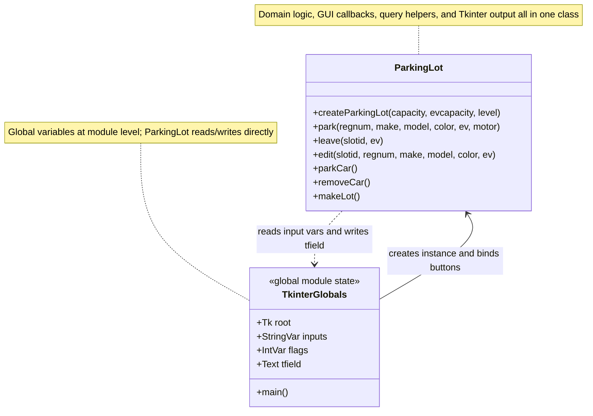
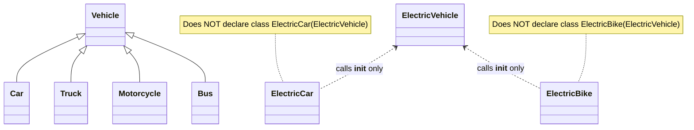
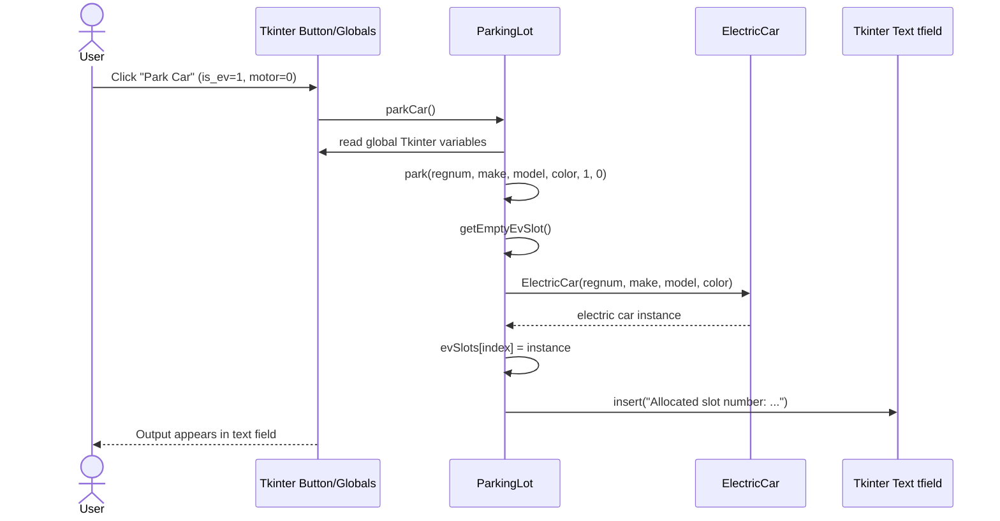
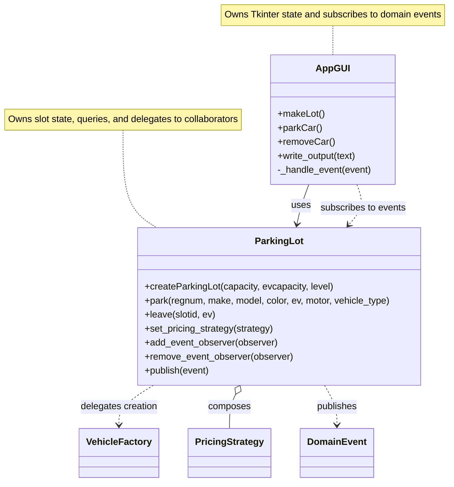
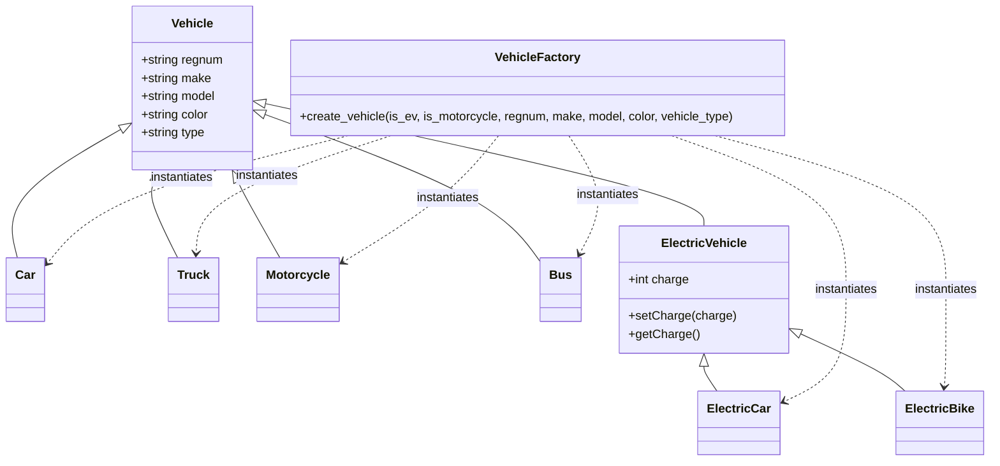
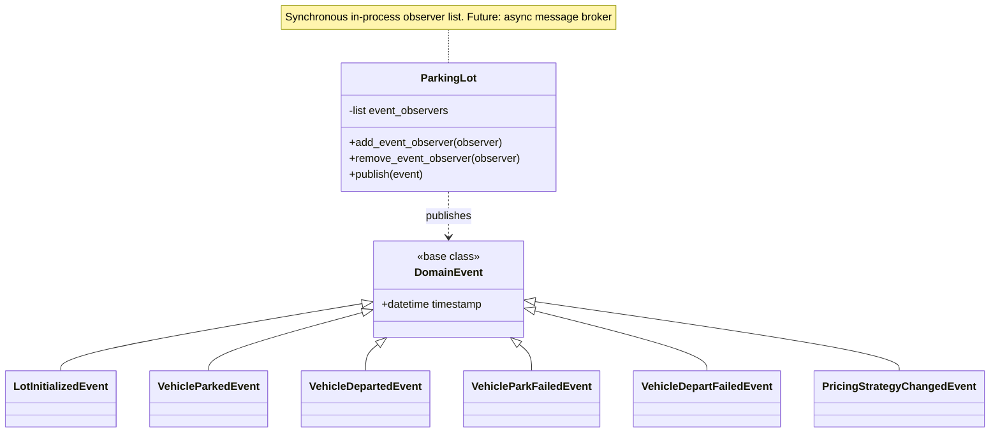
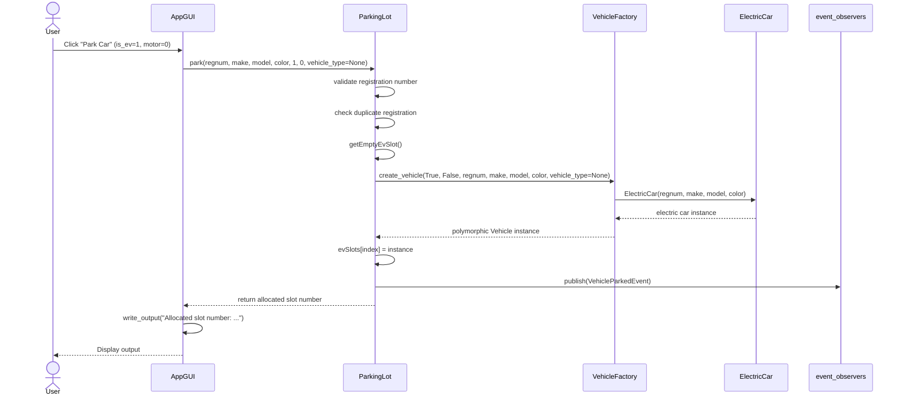
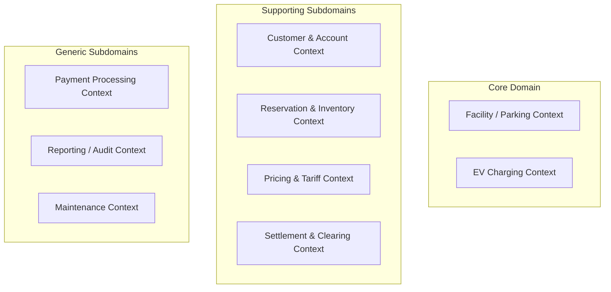
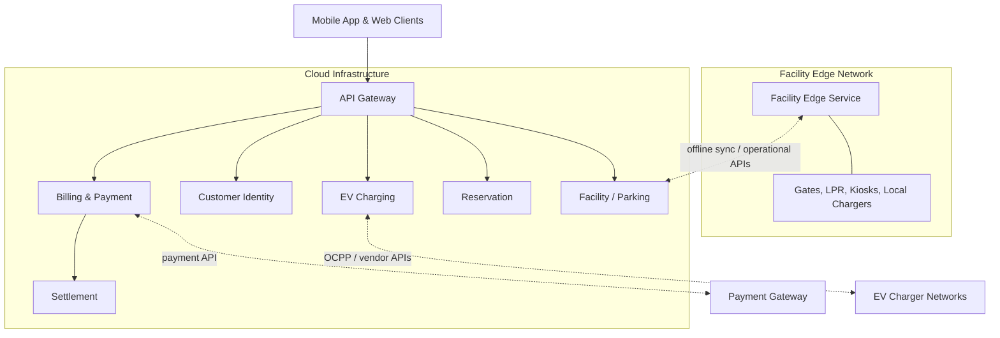

# EasyParkPlus Software Design & Architecture Final Report

## 1. Project Overview

This report presents the refactored EasyParkPlus parking lot management prototype and the proposed target architecture for scaling the system across multiple facilities with Electric Vehicle (EV) Charging Station Management.

The original codebase was a single-lot Tkinter prototype. The project work focused on:

- Reviewing the original code for poor design, coding problems, and anti-patterns.
- Refactoring the code with appropriate object-oriented design patterns.
- Representing both the original and redesigned code with UML diagrams.
- Extending the system conceptually with Domain-Driven Design (DDD).
- Proposing a preliminary microservices architecture for multi-facility EV charging operations.
- Documenting remaining prototype limitations and technical debt.

The submitted package keeps the detailed source documents in `docs/implementations/` and `docs/requirements/`. This final report is the cohesive presentation document for grading.

## 2. AI Usage Disclosure

I used AI coding tools, including Codex and Antigravity, as part of an AI-assisted software development lifecycle. I personally directed the work by defining the project goals, planning the implementation steps, reviewing requirements, and deciding what changes should be made.

The AI agents were used to help execute specific development tasks, including code refactoring, documentation drafting, diagram updates, test creation, and running verification checks. After each iteration, I manually reviewed the AI-generated work, evaluated whether it matched the project requirements, requested corrections where needed, and approved the final direction.

I remain responsible for the final submission. AI tools were used as implementation and review assistants, but I supervised the process, reviewed outputs, validated changes against the project requirements, and iterated on the work until the final product was ready.

## 3. Refactoring Summary

### 3.1 Original Design Problems

The original implementation had design problems at several levels:

- **Paradigm-level OOP problems:** weak responsibility assignment, broken inheritance, concrete-class coupling, and primitive flags used in place of clearer domain concepts.
- **Design anti-patterns:** a Smart UI style where domain logic depended on global Tkinter variables, and a `ParkingLot` class that was trending toward a God Object.
- **Maintainability problems:** duplicated code, dead code, unused imports, repeated query methods, hardcoded type strings, and mixed sentinel values with domain objects.
- **Defect risks:** inverted motorcycle/car creation logic, inconsistent slot indexing, missing bounds validation, unhandled input conversion errors, and buggy copy-paste methods.

The key issue was not just that the original code had individual bugs. The larger design problem was that the application lacked clear abstraction and service boundaries: UI control, domain state, object construction, output formatting, and query behavior were all concentrated in one module/class.

### 3.2 Refactoring Goals

The refactor aimed to:

- Separate Tkinter presentation behavior from parking domain behavior.
- Move vehicle creation out of `ParkingLot`.
- Fix the EV inheritance hierarchy.
- Preserve the original query and parking behavior where appropriate.
- Add support for trucks and buses through the same creation abstraction.
- Introduce testable extension points for pricing and domain events.
- Keep the prototype honest by documenting remaining limitations rather than claiming full production readiness.

### 3.3 Implemented Design Patterns

#### Simple Factory / Factory Method-Style Creation

Vehicle creation was extracted into `VehicleFactory.create_vehicle(...)`. This is technically closer to a Simple Factory than the strict Gang of Four Factory Method pattern because the implementation uses a centralized static creator instead of subclass-defined factory methods.

The factory supports:

- `Car`
- `Motorcycle`
- `Truck`
- `Bus`
- `ElectricCar`
- `ElectricBike`

The `ParkingLot` no longer directly constructs every concrete vehicle class.

#### Observer Pattern / Event-Driven Scaffolding

The original code directly wrote to a Tkinter text field from domain methods. The refactored code instead uses typed domain events and an observer list:

- `ParkingLot.add_event_observer(observer)`
- `ParkingLot.remove_event_observer(observer)`
- `ParkingLot.publish(event)`

The GUI subscribes to the domain events and displays them. This is not a full production event broker, but it is an event-driven scaffold that decouples the domain logic from presentation behavior.

Implemented event types include:

- `LotInitializedEvent`
- `VehicleParkedEvent`
- `VehicleDepartedEvent`
- `VehicleParkFailedEvent`
- `VehicleDepartFailedEvent`
- `PricingStrategyChangedEvent`

#### Strategy Pattern for Pricing

Parking fee calculation was extracted into a `PricingStrategy` interface with concrete strategies:

- `FlatRateStrategy`
- `EVPremiumStrategy`
- `VehicleTypeStrategy`

`ParkingLot` delegates fee calculation during `leave(...)`, so the pricing rule can change without rewriting the parking workflow.

### 3.4 Remaining Refactoring Limitations

The refactor improves the prototype but does not fully convert it into a production-grade domain model. Known limitations include:

- `ParkingLot` still owns query helpers and display-oriented report string generation.
- Public methods still use primitive flags such as `ev` and `motor`.
- There is no `ParkingSession` aggregate in the running prototype.
- EV charging is represented only through `evSlots` and a simple `charge` attribute.
- The GUI still manages only one active `ParkingLot` instance at a time.

These limitations are documented intentionally in the technical debt section rather than hidden.

## 4. UML Diagrams

The UML diagrams are split into focused diagrams because a single large class diagram became difficult to read. The source Mermaid files and PNG exports are stored in `uml_diagrams/`.

### 4.1 Original Codebase Diagrams

#### Original High-Level Structure

The original system combines domain logic, GUI callbacks, query helpers, and direct Tkinter output in `ParkingLot`.



#### Original Broken Inheritance



#### Original Parking Sequence



### 4.2 Refactored Codebase Diagrams

#### Refactored High-Level Structure



#### Refactored Vehicle and Factory Hierarchy



#### Refactored Event System



#### Refactored Parking Sequence



## 5. Domain-Driven Design

The DDD model is based on the project requirement to scale EasyParkPlus across multiple facilities and add EV Charging Station Management. Additional assumptions were informed by a technical-manager interview document.

### 5.1 Core Domain and Subdomains

**Core Domain:** Integrated Parking Management and EV Charging Management.

**Core Subdomains:**

- Access Control & Parking Sessions
- EV Charging Station Management

**Supporting Subdomains:**

- Reservations and Space Inventory
- Customer Accounts & Memberships
- Pricing & Tariff Management
- Settlement & Clearing

**Generic Subdomains:**

- Payment Processing
- Reporting, Finance, and Audits
- Maintenance & Asset Management

### 5.2 Bounded Contexts



The Facility / Parking Context and EV Charging Context both require edge and cloud capabilities because garages must continue operating during internet outages.

### 5.3 Key Domain Models

#### Facility / Parking

- **Aggregate Root:** `ParkingSession`
- **Entities:** `Ticket`, `VehicleSnapshot`, `AccessDecision`
- **Value Objects:** `LicensePlate`, `Duration`, `EntryCredential`, `ParkingRateSnapshot`
- **Invariant:** A session must have one entry event before exit, and duplicate active sessions for the same license plate and facility are rejected.

#### Facility Inventory

- **Aggregate Root:** `FacilityInventory`
- **Entities:** `ParkingSpot`, `Gate`, `FacilityRuleOverride`
- **Value Objects:** `CapacityCount`, `SpotType`, `GateStatus`
- **Invariant:** Drive-up entries must not consume reserved capacity allocated for future reservations.

#### EV Charging

- **Aggregate Root:** `ChargingSession`
- **Entities:** `ChargingMeterReading`, `IdleFeeAssessment`
- **Value Objects:** `EnergyConsumed`, `IdleDuration`, `ConnectorID`, `ChargingTariffSnapshot`
- **Invariant:** A charging session must be linked to a designated EV bay.

#### Charger Asset

- **Aggregate Root:** `ChargerAsset`
- **Entities:** `Connector`, `MaintenanceState`
- **Value Objects:** `PowerRating`, `OcppEndpoint`, `HeartbeatTimestamp`
- **Invariant:** Each connector can serve only one active charging session at a time.

#### Billing and Settlement

- **Aggregate Root:** `UnifiedInvoice`
- **Entities:** `PaymentTransaction`
- **Value Objects:** `ChargeLineItem`, `Money`, `TaxBreakdown`, `PaymentMethodToken`
- **Rule:** Parking and charging may be presented as one customer receipt while preserving separate line items for tax, refund, and settlement.

- **Aggregate Root:** `SettlementBatch`
- **Entities:** `LedgerEntry`, `VendorInvoiceMatch`, `Adjustment`
- **Value Objects:** `RevenueShareRule`, `GrossAmount`, `NetAmount`
- **Rule:** Third-party charger revenue, landlord shares, idle fees, refunds, and adjustments must be reconciled from session-level records.

## 6. Proposed Microservices Architecture

The microservices architecture is a target-state architecture, not an implementation requirement for this prototype. It is intentionally broader than the current code because the real EasyParkPlus system must support multiple facilities, offline operation, EV hardware, payments, reservations, and financial settlement.

### 6.1 High-Level Architecture



### 6.2 Services and Responsibilities

- **Facility Edge Service:** Runs locally in each garage, controls gates, processes LPR/tickets, records offline events, and continues operation during outages.
- **Facility / Parking Service:** Owns cloud-side facility configuration, parking sessions, occupancy summaries, and cross-facility parking history.
- **EV Charging Service:** Integrates with chargers through OCPP/vendor APIs and tracks charging sessions and charger status.
- **Customer Identity Service:** Owns customer profiles, authentication, monthly subscriptions, saved payment methods, and vehicle profiles.
- **Billing & Payment Service:** Calculates combined parking and charging charges, integrates with payment gateways, and produces unified invoices.
- **Reservation Service:** Manages bookings, capacity buffers, future availability, and coordination with live occupancy.
- **Settlement Service:** Reconciles revenue sharing between EasyParkPlus, third-party charger operators, and landlords.

### 6.3 Database per Service

- **Facility Edge Service:** Local PostgreSQL for offline transactional durability.
- **Facility / Parking Service:** PostgreSQL for facility, parking-session, and occupancy records.
- **EV Charging Service:** MongoDB for charger telemetry and status records.
- **Customer Identity Service:** PostgreSQL for user and account data.
- **Billing & Payment Service:** CockroachDB or HA PostgreSQL for financial consistency.
- **Reservation Service:** Redis for fast locking/availability plus PostgreSQL for confirmed bookings.
- **Settlement Service:** Snowflake or equivalent warehouse for batch analytics and reconciliation.

### 6.4 API and Event Examples

External API examples:

- `GET /api/v1/facilities`
- `GET /api/v1/facilities/{facilityId}/occupancy`
- `POST /api/v1/parking-sessions`
- `POST /api/v1/parking-sessions/{sessionId}/exit-request`
- `POST /api/v1/reservations`
- `GET /api/v1/chargers?facilityId={id}`
- `POST /api/v1/charging/sessions`
- `GET /api/v1/invoices/history`

Internal synchronous examples:

- `POST /internal/facilities/{facilityId}/entry-decision`
- `POST /internal/facilities/{facilityId}/exit-decision`
- `POST /internal/billing/calculate`
- `GET /internal/pricing/tariffs?facilityId={id}`
- `POST /internal/sync/facilities/{facilityId}/reconcile`

Asynchronous event examples:

- `Facility.VehicleEntered`
- `Facility.VehicleExited`
- `Facility.OfflineTransactionRecorded`
- `Reservation.Confirmed`
- `ParkingSession.PaymentRequired`
- `Charger.SessionEnded`
- `Charger.StatusChanged`
- `Billing.PaymentCompleted`
- `Settlement.BatchClosed`

### 6.5 DevOps and Rollout Justification

The proposed architecture should be implemented incrementally:

1. Keep the refactored parking application as the core prototype.
2. Introduce a Facility Edge Service and cloud Facility / Parking Service.
3. Add Customer Identity, Billing & Payment, and Reservation services.
4. Add EV Charging integration through OCPP/vendor adapters.
5. Add Settlement, reporting, and finance workflows.

DevOps practices should include CI/CD, contract tests, event schema versioning, observability, feature flags, infrastructure as code, and rollback-friendly edge deployments.

## 7. Prototype Limitations and Technical Debt

The submitted implementation is a refactored prototype, not the full target architecture. The main gaps are:

| Area | Prototype Scaffolding | Missing for Production |
|------|----------------------|------------------------|
| EV Charging | `evSlots`, `chargeStatus()` | Charger state machine, OCPP, EV-bay enforcement |
| Offline Autonomy | In-memory local state | Persistent edge DB, sync, conflict reconciliation |
| Parking Sessions | `slotid` primitive | `ParkingSession` aggregate, timestamps, customer linkage |
| Reservations | Capacity counters | Reservation entity, priority rules, reserved buffers |
| Event Streaming | Typed in-process `DomainEvent` classes | Async broker, event store, schema versioning |
| Facility Variability | Strategy + Factory extension points | Multi-facility config, hardware adapters |
| Billing & Settlement | `PricingStrategy` hierarchy | Duration pricing, unified invoice, payment gateway |
| Security | Basic validation | Auth, RBAC, transactional slot locking |

These limitations are acceptable for a course prototype because the project asks for a refactored application plus architecture documentation, not a full production implementation.

## 8. Testing and Verification

The refactored code includes unit tests for:

- Vehicle properties and inheritance.
- Vehicle factory creation and validation.
- Parking lot creation, parking, leaving, queries, and bounds checks.
- Domain event publication.
- Pricing strategy behavior.

Verification command:

```bash
cd project_3_software_design
python -m unittest discover -s refactored_code -p "test_*.py"
```

Latest verified result:

```text
Ran 55 tests
OK
```

## 9. Requirement Traceability

| Requirement | Where Addressed |
|-------------|-----------------|
| Identify and improve bad coding practices | Refactoring Summary; detailed source doc `09_Refactoring_Justification.md` |
| Use at least two OO design patterns | Factory-style creation, Observer/event scaffolding, Strategy |
| UML for original design | Section 4.1 and `docs/implementations/11_UML_Diagrams.md` |
| UML for redesigned code | Section 4.2 and `docs/implementations/11_UML_Diagrams.md` |
| Written justification for changes and patterns | Sections 3 and 4; detailed source doc `09_Refactoring_Justification.md` |
| DDD core domains and bounded contexts | Section 5; detailed source doc `08_Domain_Driven_Design.md` |
| Basic domain models for parking and EV charging | Section 5.3 |
| Microservices architecture diagram | Section 6.1 |
| Services and responsibilities | Section 6.2 |
| APIs/endpoints | Section 6.4 |
| Separate DBs per service | Section 6.3 |
| Updated source code | `refactored_code/` |
| Screenshots/application evidence | `assets/Screenshot 2026-05-27 145128.png` |
| Prototype limitations vs. real requirements | Section 7; detailed source doc `12_Mock_Implementation_vs_Manager_Requirements.md` |

## 10. Submission Contents

The final project package should include:

- `refactored_code/` with updated source code and tests.
- `legacy_code/` for comparison against the original prototype.
- `uml_diagrams/` with Mermaid sources and PNG exports.
- `docs/Final_Report.md` as the main cohesive report.
- `docs/implementations/` as supporting detailed documentation.
- `docs/requirements/` as preserved requirement/rubric material.
- `assets/` with screenshot evidence of the application running.

