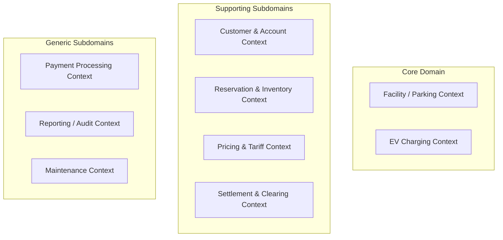
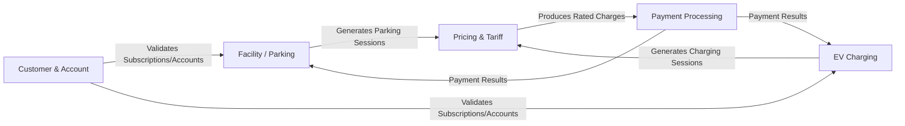
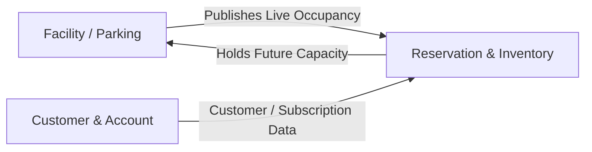
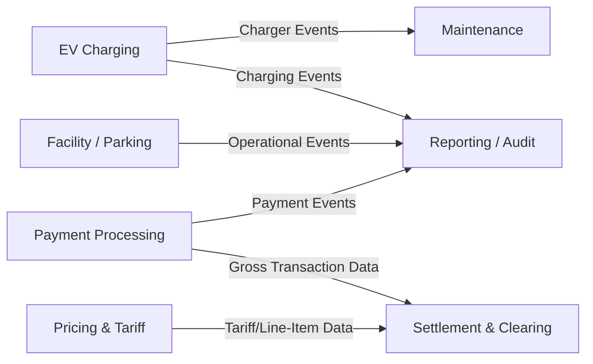

# Domain-Driven Design (DDD) for EasyParkPlus

Based on the requirements and the technical interview with Michael, the Technical Manager, here is the Domain-Driven Design for the EasyParkPlus system, including the new Electric Vehicle (EV) Charging Station Management feature.

## 1. Core Domain and Subdomains

**Core Domain:** The core competitive advantage of EasyParkPlus revolves around providing seamless, integrated **Parking Management** combined with **EV Charging Management**. 

**Subdomains:**
* **Core Subdomains:** 
    * Access Control & Parking Sessions (Offline-capable)
    * EV Charging Station Management (OCPP integration)
* **Supporting Subdomains:** 
    * Reservations and Space Inventory
    * Customer Accounts & Memberships
    * Pricing & Tariff Management (corporate rules with facility-level overrides)
    * Settlement & Clearing (3rd-party vendor revenue sharing)
* **Generic Subdomains:** 
    * Payment Processing (external gateway integration)
    * Reporting, Finance, and Audits
    * Maintenance & Asset Management

This classification follows Michael's interview responses: payment processing itself is not EasyParkPlus's competitive advantage and may be outsourced, but pricing rules, validations, EV tariffs, idle-fee rules, and facility overrides remain internally owned. Michael also explicitly identified Settlement/Clearing as a separate operational domain for third-party charger and landlord revenue sharing.

---

## 2. Bounded Contexts

Based on the subdomains, we can define the following **Bounded Contexts** to compartmentalize the system. The first diagram shows the context groups at a high level; the smaller diagrams below show the most important relationships without overloading the main view.

### Operational Context Relationships

This diagram shows the contexts involved in vehicle entry/exit, charging, pricing, and payment.

### Reservation and Capacity Relationships

This diagram clarifies the ownership boundary between live facility occupancy and future reservation holds.

### Settlement, Reporting, and Maintenance Relationships

This diagram shows supporting and generic contexts that consume operational, charging, tariff, and payment data.

> [!IMPORTANT]
> **Offline Autonomy:** The **Facility / Parking Context** and **EV Charging Context** require both edge and cloud capabilities. At the edge, they must continue local operations such as gate decisions, ticketing, occupancy tracking, and charging-session continuation when internet connectivity drops. In the cloud, they synchronize operational records, support cross-facility visibility, and feed reporting and settlement.

---

## 3. Bounded Context Definitions & Ubiquitous Language

### A. Facility / Parking Context
* **Responsibilities:** Handling vehicle entry/exit, tracking active parking sessions, local physical occupancy, facility configuration, and physical gate control. Must operate independently during internet outages.
* **Ubiquitous Language:** Parking Session, Ticket, Entry Gate, Exit Gate, License Plate Recognition (LPR), Capacity Buffer, Offline Mode.

### B. EV Charging Context
* **Responsibilities:** Managing EV charger hardware, tracking charging sessions, communicating with OCPP gateways, and monitoring real-time charger states.
* **Ubiquitous Language:** Charging Session, Charger Status, EV Bay, OCPP, Connector, Energy Consumed (kWh), Idle Grace Period.

### C. Customer & Account Context
* **Responsibilities:** Managing global user accounts, monthly subscriptions, saved payment methods, and vehicle profiles.
* **Ubiquitous Language:** Customer Account, Monthly Parking Contract, Saved Payment Method, Vehicle Profile, Subscriber.

### D. Payment Processing / Billing Context
* **Responsibilities:** Creating unified invoices, coordinating payment authorization/capture with external payment providers, and recording payment results. Payment provider integration is generic, while internal fee rules come from the Pricing & Tariff Context.
* **Ubiquitous Language:** Unified Invoice, Payment Transaction, Authorization, Capture, Refund, Payment Method Token, Receipt.

### E. Reservation & Inventory Context
* **Responsibilities:** Central management of future bookings and reservation capacity holds. It consumes live occupancy from Facility / Parking but owns reservation windows, priority rules, and capacity buffers for future demand.
* **Ubiquitous Language:** Reservation, Guaranteed Spot, Capacity Buffer, Degraded Mode, Yield Management.

### F. Pricing & Tariff Context
* **Responsibilities:** Managing corporate pricing rules, EV tariffs, idle-fee rules, facility-level overrides, regulatory constraints, and tariff snapshots used for offline execution.
* **Ubiquitous Language:** Tariff Rule, Base Rate, Charging Rate, Idle Fee Rule, Facility Override, Regulatory Constraint, Effective Period.

### G. Settlement & Clearing Context
* **Responsibilities:** Reconciling financial transactions and splitting revenue between EasyParkPlus, 3rd party EV charger operators, and landlords.
* **Ubiquitous Language:** Revenue Share, Vendor Invoice, Net Amount, Gross Amount, Reconciliation, Ledger Entry.

### H. Reporting / Audit and Maintenance Contexts
* **Responsibilities:** Reporting and audit consume parking, payment, and charging events for finance and operational analytics. Maintenance consumes charger and equipment events for repair workflows.
* **Ubiquitous Language:** Audit Trail, Utilization Report, Fault Event, Maintenance Ticket, Asset Health.

These contexts are identified because Michael listed reporting, finance, audits, maintenance, enforcement, and asset management as operational areas. They are not modeled in depth here because the project requirement asks for basic domain models for parking management and EV charging, with supporting models where they directly affect those workflows.

### Context-to-Service Mapping Note

The microservices architecture uses service names that are intentionally close to these bounded contexts. The **Facility / Parking Context** maps to the **Facility / Parking Service**. The **EV Charging Context** maps to the **EV Charging Service**. The **Reservation & Inventory**, **Customer & Account**, and **Settlement & Clearing** contexts map directly to their corresponding services. The **Pricing & Tariff Context** is shown as a distinct DDD boundary because Michael identified corporate pricing, facility overrides, EV tariffs, and regulatory constraints as internally owned rules; in the preliminary architecture it may be implemented as a pricing component inside the Billing / Payment workflow before becoming a standalone service.

---

## 4. Basic Domain Models (Entities, Value Objects, Aggregates)

Here is a preliminary structural model for the core contexts and the supporting contexts that interact directly with parking and EV charging.

### Facility / Parking Domain Model
* **Aggregate Root: `ParkingSession`**
    * **Properties:** SessionID, FacilityID, EntryTime, ExitTime, Status (Active, PaymentPending, Completed, Cancelled), SessionType (Transient, Reservation, MonthlySubscriber), OfflineCaptured flag
    * **Entities:** `Ticket`, `VehicleSnapshot`, `AccessDecision`
    * **Value Objects:** `LicensePlate`, `Duration`, `EntryCredential`, `ParkingRateSnapshot`
    * **Invariants:** A session must have one entry event before exit; an exit gate cannot open until payment/subscription validation succeeds; duplicate active sessions for the same license plate and facility are rejected.
* **Aggregate Root: `FacilityInventory`**
    * **Properties:** FacilityID, TotalCapacity, AvailableCapacity, ReservedCapacityBuffer, OperatingMode (Online, Offline, Degraded)
    * **Entities:** `ParkingSpot`, `Gate`, `FacilityRuleOverride`
    * **Value Objects:** `CapacityCount`, `SpotType` (Regular, EV, Accessible, Reserved), `GateStatus`
    * **Invariants:** Facility / Parking owns live physical occupancy counts and gate decisions. Drive-up entries must not consume the reserved capacity buffer that Reservation & Inventory has allocated for future reservations.
* **Entity: `Facility`**
    * **Properties:** FacilityID, City, Address, LocalTimezone, AccessMechanism (BoomGate, LPR, Hybrid)

### EV Charging Domain Model
* **Aggregate Root: `ChargingSession`**
    * **Properties:** ChargingSessionID, FacilityID, ParkingSessionID, StartTime, EndTime, Status (Preparing, Charging, Suspended, Finishing, Completed, Faulted), VendorSessionID
    * **Entities:** `ChargingMeterReading`, `IdleFeeAssessment`
    * **Value Objects:** `EnergyConsumed` (kWh), `IdleDuration` (Minutes), `ConnectorID`, `ChargingTariffSnapshot`
    * **Invariants:** A charging session must be linked to a designated EV bay; idle fees start only after the configured grace period; interrupted or faulted sessions keep enough meter data for adjustment and settlement.
* **Aggregate Root: `ChargerAsset`**
    * **Properties:** ChargerID, FacilityID, Vendor, Protocol (OCPP or VendorAPI), MaxOutput, Status (Available, Occupied, Preparing, Charging, Suspended, Finishing, Faulted, Offline)
    * **Entities:** `Connector`, `MaintenanceState`
    * **Value Objects:** `PowerRating`, `OcppEndpoint`, `HeartbeatTimestamp`
    * **Invariants:** A charger can expose one or more connectors, but each connector can serve only one active charging session at a time.
* **Entity: `EVBay`**
    * **Properties:** BayID, FacilityID, LinkedChargerID, LinkedConnectorID, Location, OccupancyStatus, ReservationEligibility
    * **Rule:** Dual-port chargers may map to two adjacent EV bays; charger state and physical bay occupancy are tracked separately.

### Reservation & Inventory Domain Model
* **Aggregate Root: `Reservation`**
    * **Properties:** ReservationID, CustomerID, FacilityID, ReservedWindow, SpotTypeRequested, Status (Requested, Confirmed, Honored, NoShow, Cancelled)
    * **Value Objects:** `ReservationPriority`, `CapacityHold`, `ReservationWindow`
    * **Invariants:** Reservation & Inventory owns future capacity holds, not live physical occupancy. Central reservations can continue while a facility is offline, but capacity buffers limit overbooking; conflicts after reconnection are resolved by priority: reservations, then subscriptions, then drive-up traffic.

### Payment Processing / Billing Domain Model
* **Aggregate Root: `UnifiedInvoice`**
    * **Properties:** InvoiceID, CustomerID, ParkingSessionID, ChargingSessionID, TotalAmount, Status (Pending, Paid, Failed, Adjusted)
    * **Entities:** `PaymentTransaction`
    * **Value Objects:** `ChargeLineItem` (Parking Fee, Charging Fee, Idle Fee), `Money`, `TaxBreakdown`, `PaymentMethodToken`
    * **Invariants:** Parking and charging may be presented as one receipt while preserving separate line items for tax, refunds, and settlement. External payment capture can be delegated to a payment gateway, but EasyParkPlus keeps the invoice and transaction record.

### Pricing & Tariff Domain Model
* **Aggregate Root: `TariffPolicy`**
    * **Properties:** PolicyID, FacilityID, EffectivePeriod, Source (Corporate, FacilityOverride, Regulatory)
    * **Value Objects:** `ParkingRate`, `ChargingRate`, `IdleFeeRule`, `OverrideLimit`
    * **Rule:** Corporate operations own the default source of truth, while facility managers can apply controlled local overrides within approved limits. This reflects Michael's interview response that core pricing strategy is centrally defined but can have bounded local flexibility.

### Settlement & Clearing Domain Model
* **Aggregate Root: `SettlementBatch`**
    * **Properties:** BatchID, SettlementPeriod, Status, VendorID, FacilityID
    * **Entities:** `LedgerEntry`, `VendorInvoiceMatch`, `Adjustment`
    * **Value Objects:** `RevenueShareRule`, `GrossAmount`, `NetAmount`
    * **Rule:** Third-party charger revenue, landlord shares, idle fees, refunds, and failed-session adjustments must be reconcilable from session-level records. This is separate from Billing & Payment because Michael explicitly identified vendor/landlord clearing as a dedicated operational domain.

> [!NOTE]
> The `UnifiedInvoice` acts as the financial sink where the `ParkingSession` and `ChargingSession` are combined to present a single payment request to the driver, satisfying the business requirement for a unified customer experience while preserving separate tracking for settlement.
