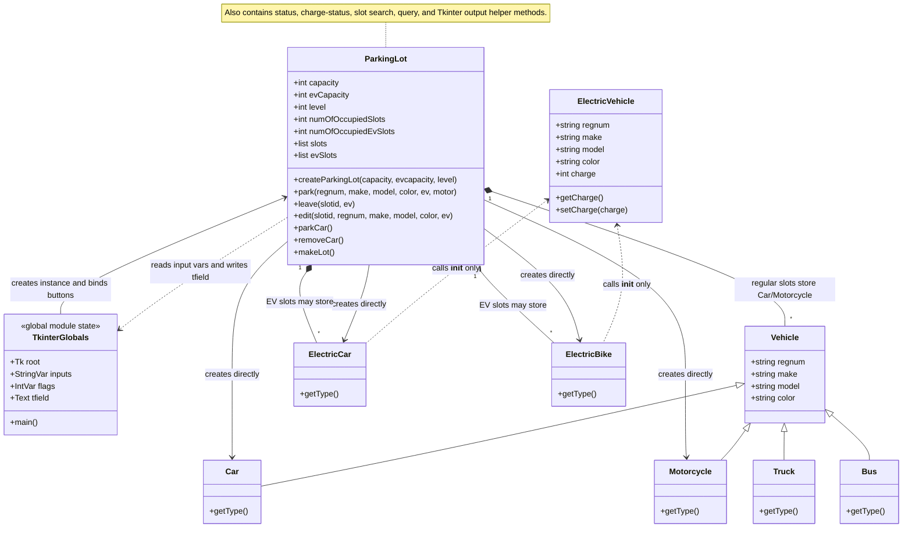
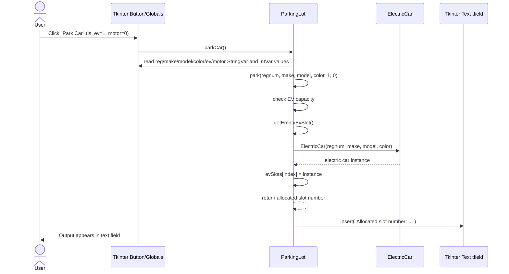
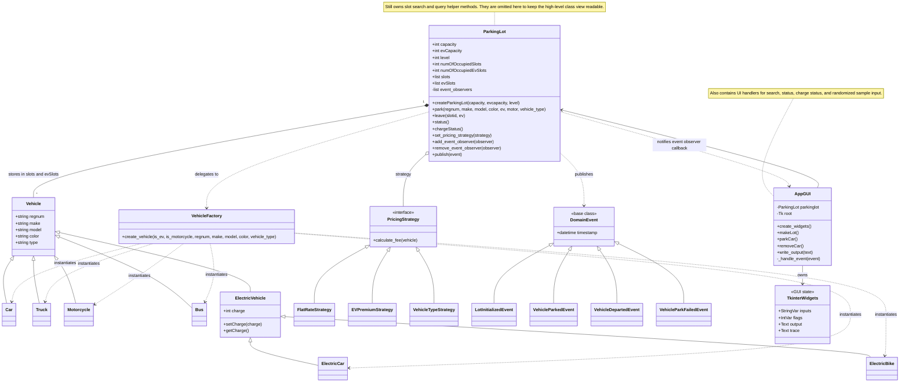
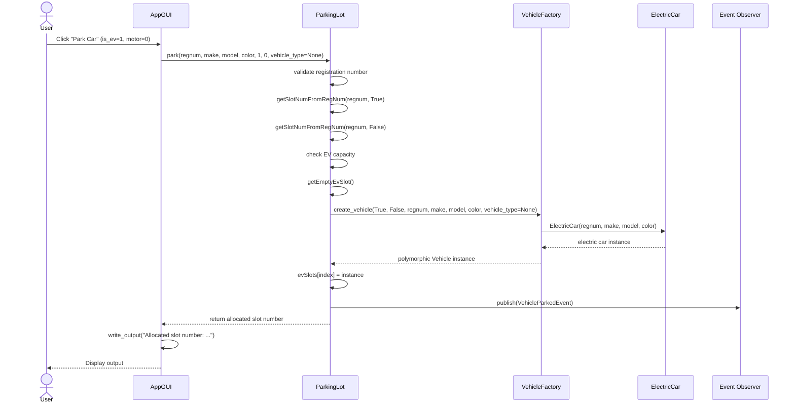

# UML Diagrams (Original vs. Refactored)

As required by the project rubrics, here are the two sets of UML diagrams (Structural and Behavioral) representing the application before and after refactoring.

The Mermaid diagrams below are the canonical diagrams. PNG exports are stored in [`../../uml_diagrams/`](../../uml_diagrams/), but they should be regenerated from the `.mmd` sources if the Mermaid source changes.

To keep the diagrams readable, the class diagrams show the methods that explain the main design relationships. Routine getters, repeated search/query helpers, and simple report-formatting methods are described in notes instead of being listed one by one.

---

## Part 1: Original Codebase

### 1. Structural Diagram (Class Diagram)
This diagram illustrates the original, tightly coupled structure. Notice the broken inheritance chain where `ElectricCar` and `ElectricBike` call `ElectricVehicle.__init__()` but do not actually extend `ElectricVehicle`. The legacy `ParkingLot` also contains GUI callback methods and directly instantiates the supported concrete vehicle classes used by the manager.

*Source: [`../../uml_diagrams/original_class_diagram.mmd`](../../uml_diagrams/original_class_diagram.mmd)*

### 2. Behavioral Diagram (Sequence Diagram - Parking a Car)
This sequence diagram shows the flow of parking an Electric Car in the original code. The Tkinter button is bound to `ParkingLot.parkCar()`, which reads global Tkinter variables, calls `ParkingLot.park()`, and then writes the result to the global text field. The `ParkingLot` class directly handles the conditional logic to figure out which concrete class (`ElectricCar`, `ElectricBike`, `Car`, `Motorcycle`) to instantiate.

*Source: [`../../uml_diagrams/original_sequence_diagram.mmd`](../../uml_diagrams/original_sequence_diagram.mmd)*

---

## Part 2: Re-Designed Codebase

### 1. Structural Diagram (Class Diagram)
This diagram illustrates the refactored architecture. The `AppGUI` is separated from the `ParkingLot` and owns the Tkinter state. The `ParkingLot` supports observer-style trace notifications, so UI or logging components can subscribe to domain events. Vehicle creation is delegated to `VehicleFactory`, which centralizes the concrete type decision for `Car`, `Truck`, `Motorcycle`, `Bus`, `ElectricCar`, and `ElectricBike`. The inheritance chain for electric vehicles has been corrected.

*Source: [`../../uml_diagrams/refactored_class_diagram.mmd`](../../uml_diagrams/refactored_class_diagram.mmd)*

### 2. Behavioral Diagram (Sequence Diagram - Parking a Car)
This sequence diagram shows the refactored flow. The GUI now interacts with the `ParkingLot`, which validates the request, checks for duplicate registrations, and requests a vehicle instance from `VehicleFactory`. The GUI is responsible for displaying the returned result, while trace messages are delivered through the registered observer callback.

*Source: [`../../uml_diagrams/refactored_sequence_diagram.mmd`](../../uml_diagrams/refactored_sequence_diagram.mmd)*
