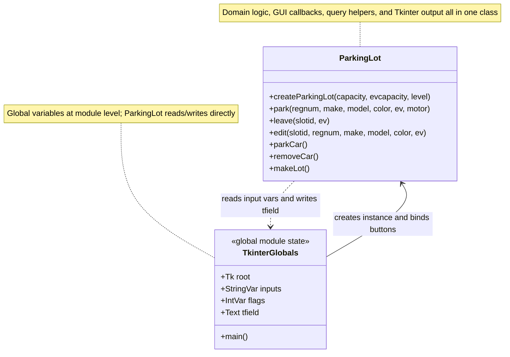
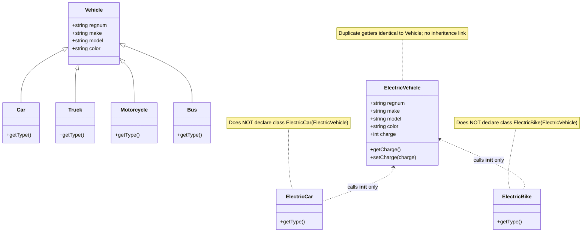
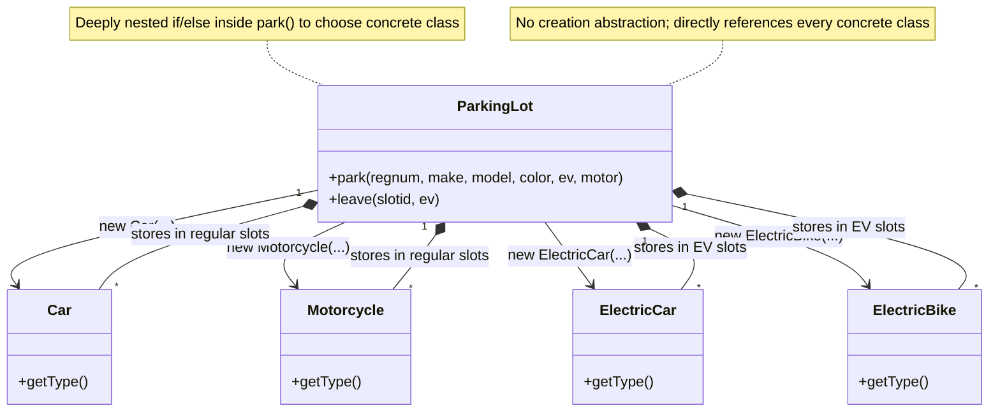
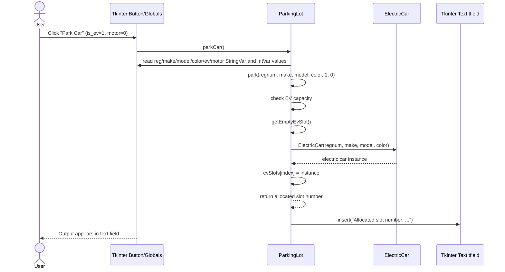
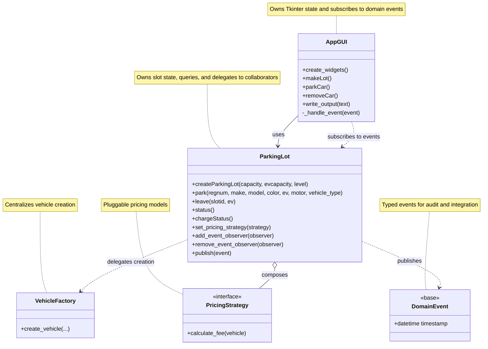
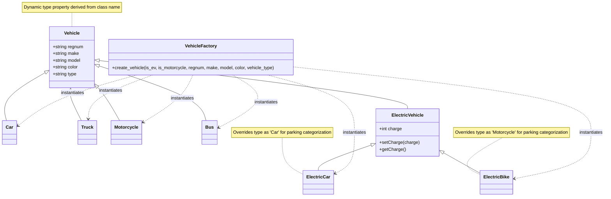
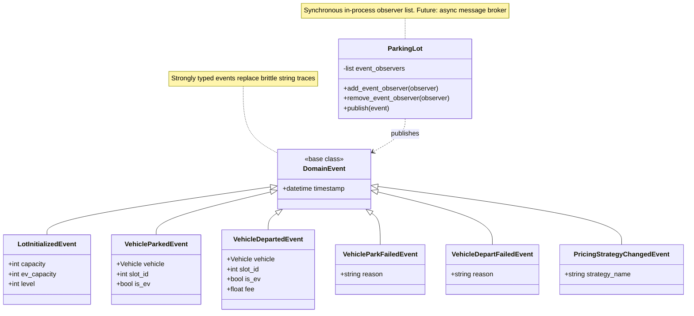
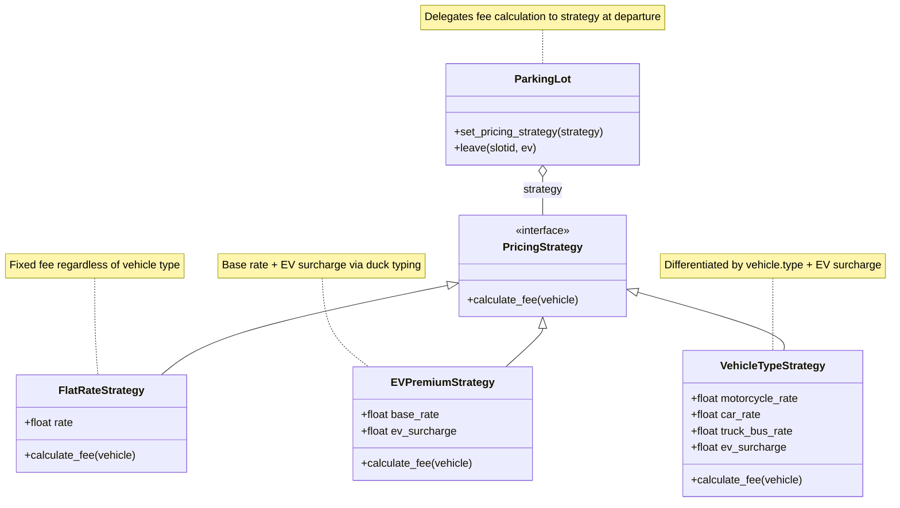
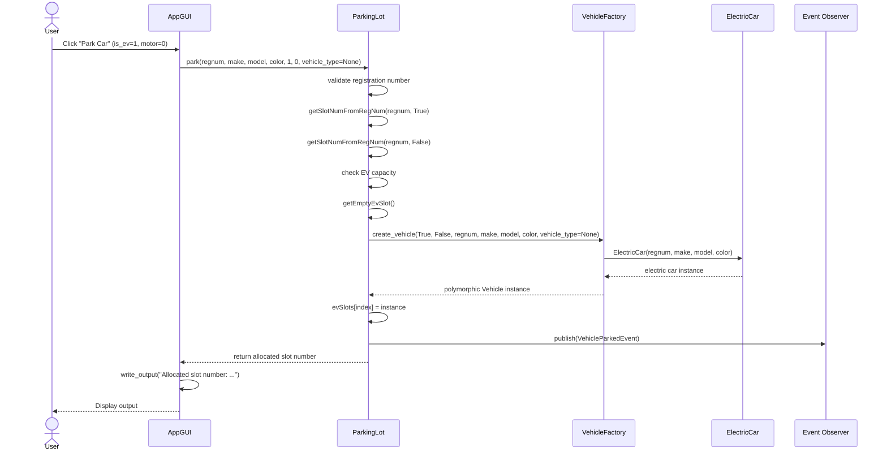

# UML Diagrams (Original vs. Refactored)

As required by the project rubrics, here are the two sets of UML diagrams (Structural and Behavioral) representing the application before and after refactoring.

The Mermaid diagrams below are the canonical diagrams. PNG exports are stored in [`../../uml_diagrams/`](../../uml_diagrams/), but they should be regenerated from the `.mmd` sources if the Mermaid source changes.

To keep the diagrams readable, the class diagrams show the methods that explain the main design relationships. Routine getters, repeated search/query helpers, and simple report-formatting methods are described in notes instead of being listed one by one.

---

## Part 1: Original Codebase

### 1. Structural Diagrams (Class Diagrams)

The original architecture is shown as a set of focused diagrams, each highlighting a specific design problem.

#### a) High-Level System Overview
This diagram shows the monolithic structure: `ParkingLot` contains domain logic, GUI callbacks, query helpers, and direct Tkinter output code all in one class. Tkinter state lives as global module variables.

*Source: [`../../uml_diagrams/original_overview_diagram.mmd`](../../uml_diagrams/original_overview_diagram.mmd)*

#### b) Broken Inheritance
This diagram isolates the inheritance problem: `ElectricCar` and `ElectricBike` call `ElectricVehicle.__init__()` but do not formally declare `class ElectricCar(ElectricVehicle)`. They also duplicate getter methods already present in `Vehicle`.

*Source: [`../../uml_diagrams/original_broken_inheritance_diagram.mmd`](../../uml_diagrams/original_broken_inheritance_diagram.mmd)*

#### c) Direct Instantiation
This diagram isolates the concrete-class coupling: `ParkingLot` directly instantiates `Car`, `Motorcycle`, `ElectricCar`, and `ElectricBike` inside deeply nested `if/else` logic. There is no creation abstraction.

*Source: [`../../uml_diagrams/original_direct_instantiation_diagram.mmd`](../../uml_diagrams/original_direct_instantiation_diagram.mmd)*

### 2. Behavioral Diagram (Sequence Diagram - Parking a Car)
This sequence diagram shows the flow of parking an Electric Car in the original code. The Tkinter button is bound to `ParkingLot.parkCar()`, which reads global Tkinter variables, calls `ParkingLot.park()`, and then writes the result to the global text field. The `ParkingLot` class directly handles the conditional logic to figure out which concrete class (`ElectricCar`, `ElectricBike`, `Car`, `Motorcycle`) to instantiate.

*Source: [`../../uml_diagrams/original_sequence_diagram.mmd`](../../uml_diagrams/original_sequence_diagram.mmd)*

---

## Part 2: Re-Designed Codebase

### 1. Structural Diagrams (Class Diagrams)

The refactored architecture is shown as a set of focused diagrams rather than one overloaded class diagram. This mirrors the DDD bounded-context approach used elsewhere in the documentation.

#### a) High-Level System Overview
This diagram shows the main architectural components and their responsibilities at a glance.

*Source: [`../../uml_diagrams/refactored_overview_diagram.mmd`](../../uml_diagrams/refactored_overview_diagram.mmd)*

#### b) Vehicle & Factory Hierarchy
This diagram focuses on the inheritance tree and the Factory Method pattern.

*Source: [`../../uml_diagrams/refactored_vehicle_factory_diagram.mmd`](../../uml_diagrams/refactored_vehicle_factory_diagram.mmd)*

#### c) Event-Driven Architecture
This diagram focuses on the Observer / Event-Driven pattern and the typed domain event hierarchy.

*Source: [`../../uml_diagrams/refactored_event_system_diagram.mmd`](../../uml_diagrams/refactored_event_system_diagram.mmd)*

#### d) Pricing Strategy
This diagram focuses on the Strategy pattern for pluggable fee calculation.

*Source: [`../../uml_diagrams/refactored_pricing_strategy_diagram.mmd`](../../uml_diagrams/refactored_pricing_strategy_diagram.mmd)*

### 2. Behavioral Diagram (Sequence Diagram - Parking a Car)
This sequence diagram shows the refactored flow. The GUI now interacts with the `ParkingLot`, which validates the request, checks for duplicate registrations, and requests a vehicle instance from `VehicleFactory`. The GUI is responsible for displaying the returned result, while trace messages are delivered through the registered observer callback.

*Source: [`../../uml_diagrams/refactored_sequence_diagram.mmd`](../../uml_diagrams/refactored_sequence_diagram.mmd)*
