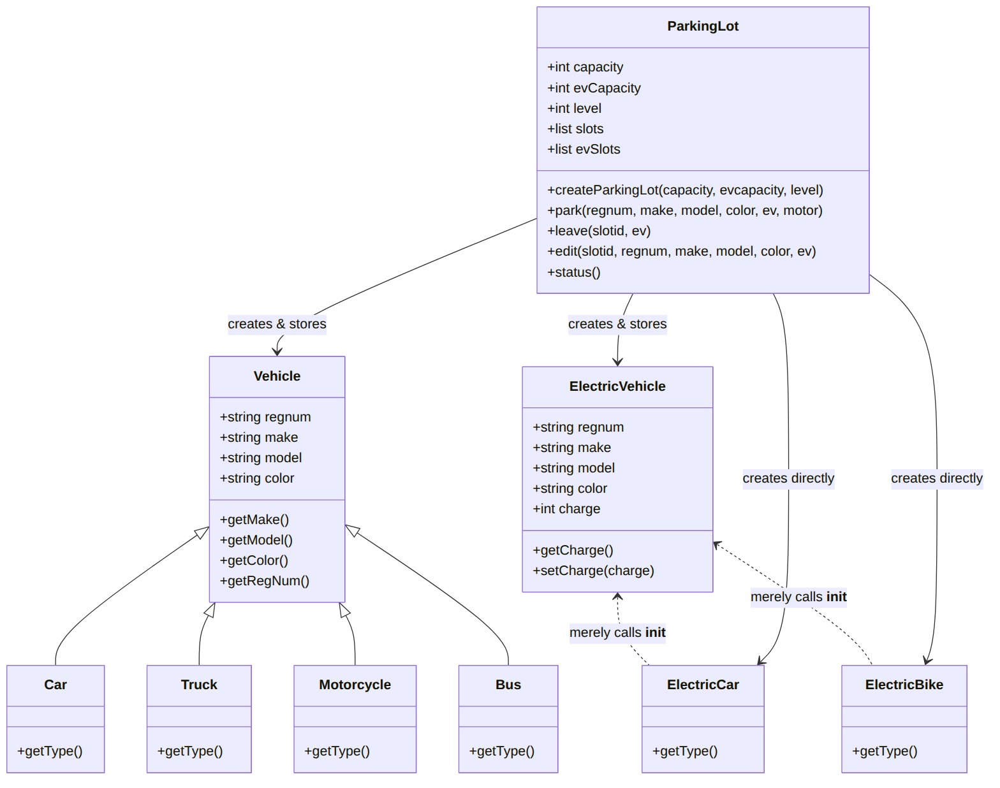
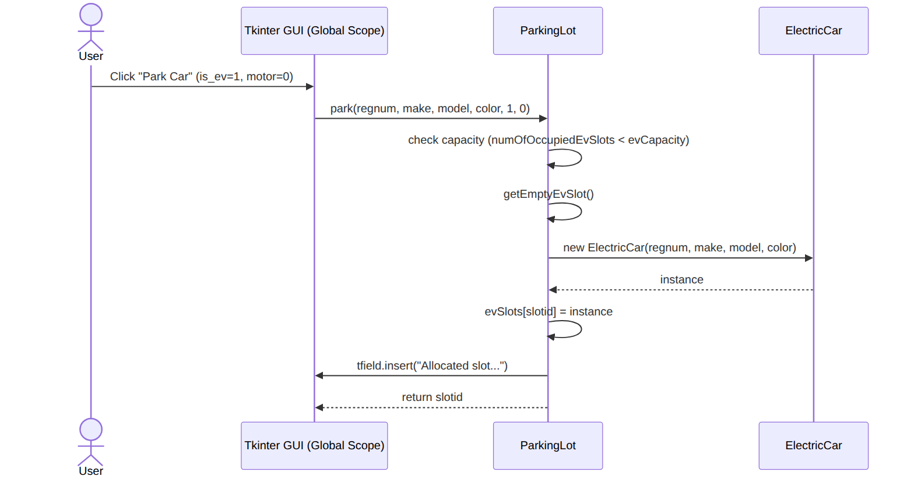
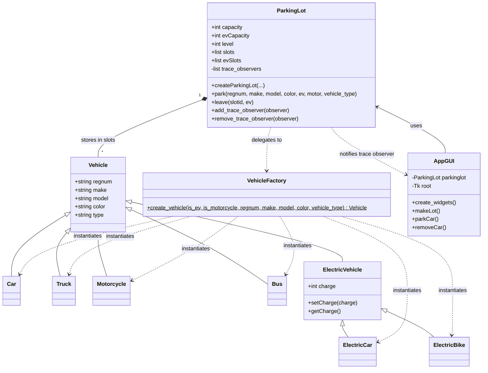
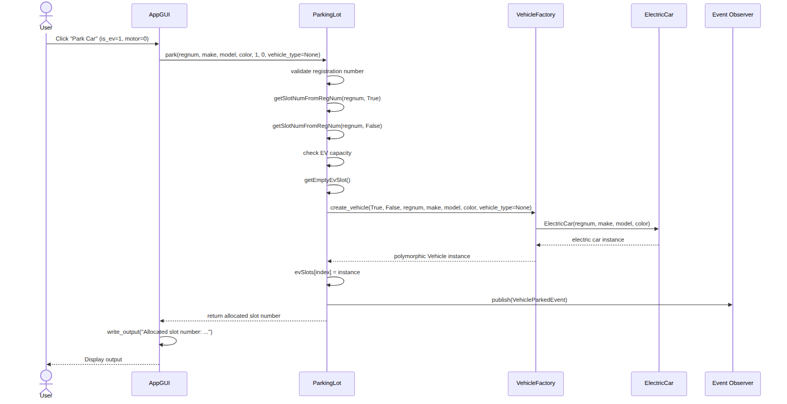

# UML Diagrams (Original vs. Refactored)

As required by the project rubrics, here are the two sets of UML diagrams (Structural and Behavioral) representing the application before and after refactoring.

> **Rendered PNG versions** of all diagrams are available in the [`../../uml_diagrams/`](../../uml_diagrams/) folder.

---

## Part 1: Original Codebase

### 1. Structural Diagram (Class Diagram)
This diagram illustrates the original, tightly coupled structure. Notice the broken inheritance chain where `ElectricCar` and `ElectricBike` fail to properly extend `ElectricVehicle`. The `ParkingLot` directly instantiates multiple concrete classes, creating tight coupling.

*Source: [`../../uml_diagrams/original_class_diagram.mmd`](../../uml_diagrams/original_class_diagram.mmd)*

### 2. Behavioral Diagram (Sequence Diagram - Parking a Car)
This sequence diagram shows the flow of parking an Electric Car in the original code. The `ParkingLot` class directly handles the conditional logic to figure out which concrete class (`ElectricCar`, `ElectricBike`, `Car`, `Motorcycle`) to instantiate.

*Source: [`../../uml_diagrams/original_sequence_diagram.mmd`](../../uml_diagrams/original_sequence_diagram.mmd)*

---

## Part 2: Re-Designed Codebase

### 1. Structural Diagram (Class Diagram)
This diagram illustrates the refactored architecture. The `AppGUI` is cleanly separated from the `ParkingLot`. The `ParkingLot` supports the **Observer** pattern for trace/output notifications, so each facility can have independent state while UI or logging components subscribe to events. Furthermore, the `ParkingLot` no longer knows about concrete vehicle implementations; it delegates instantiation to the `VehicleFactory` (**Factory Method** pattern). The inheritance chain for Electric Vehicles has been corrected.

*Source: [`../../uml_diagrams/refactored_class_diagram.mmd`](../../uml_diagrams/refactored_class_diagram.mmd)*

### 2. Behavioral Diagram (Sequence Diagram - Parking a Car)
This sequence diagram shows the refactored flow. The GUI now interacts with the `ParkingLot`, which cleanly requests a vehicle instance from the `VehicleFactory`. The GUI is fully responsible for updating the display, and the `ParkingLot` simply returns the result data.

*Source: [`../../uml_diagrams/refactored_sequence_diagram.mmd`](../../uml_diagrams/refactored_sequence_diagram.mmd)*
